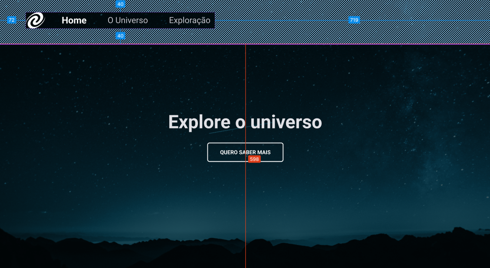

# Uso do JavaScript

### Essa tarefa faz parte do curso Explorer da [Rocketseat](https://www.rocketseat.com.br).

Nessa atividade foram abordadas as seguintes questões:

- Animações com o CSS;
- Funções no JS;
- Manipulação da DOM;
- Conceitos de SPA;
- Mapeamento de rotas;
- Assíncrono e promises;
- Orientação a objetos;
- Classes;

## 🔖 Layout 

O figma do projeto está disponível nesse [Link](<https://www.figma.com/file/0Cxd3N4jBgwZZBHPgFGWgC/%5BDesafios-Explorer%5D-SPA-Universe-(Copy)?node-id=0%3A1&mode=dev>).

